# How to set up a new SSH key on Roar

The settings on Roar are such that you can't use https protocols to push or pull to Github. Bummer, because that means you will have to do this sort of annoying process before the first time you push or pull to Github. You only need to do this once, so if you already did this, you're golden!

## Step 1: Generate a new SSH key and add it to the ssh-agent

Following the instructions [here](https://docs.github.com/en/free-pro-team@latest/github/authenticating-to-github/generating-a-new-ssh-key-and-adding-it-to-the-ssh-agent) for Linux, do the following steps: 

### 1. Log onto the cluster and open a terminal

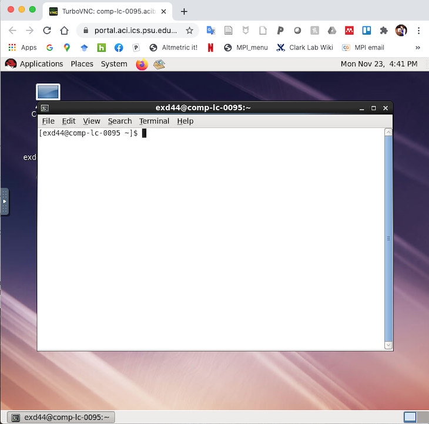

### 2. Type the text below, making sure you use _your_ GitHub email address and not mine!

`ssh-keygen -t rsa -b 4096 -C "your_email@example.com"`  

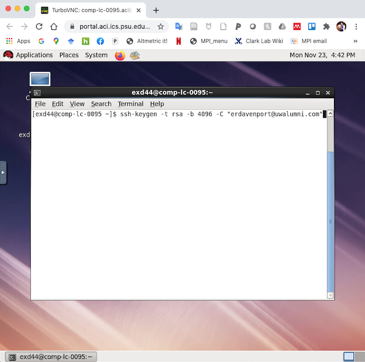

### 3. When you're prompted to "Enter file in which to save the key", press Enter (accepts the default file location).

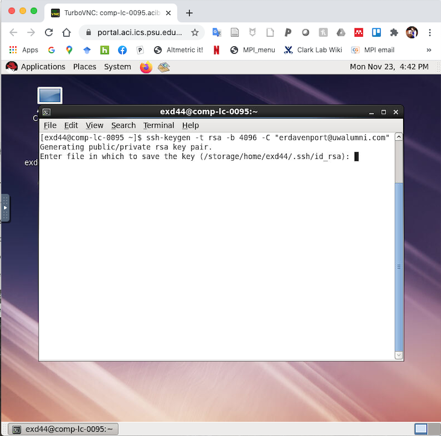

### 4. When it asks for a passphrase, either enter a passphrase if you would like or hit enter to leave blank. Repeat the same passphrase again.

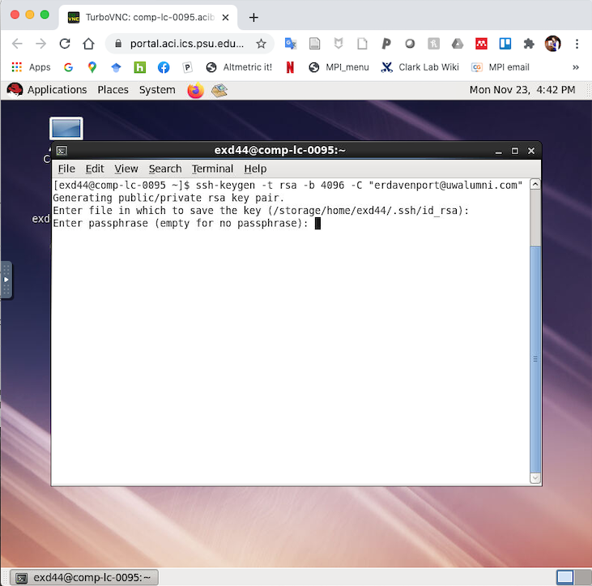
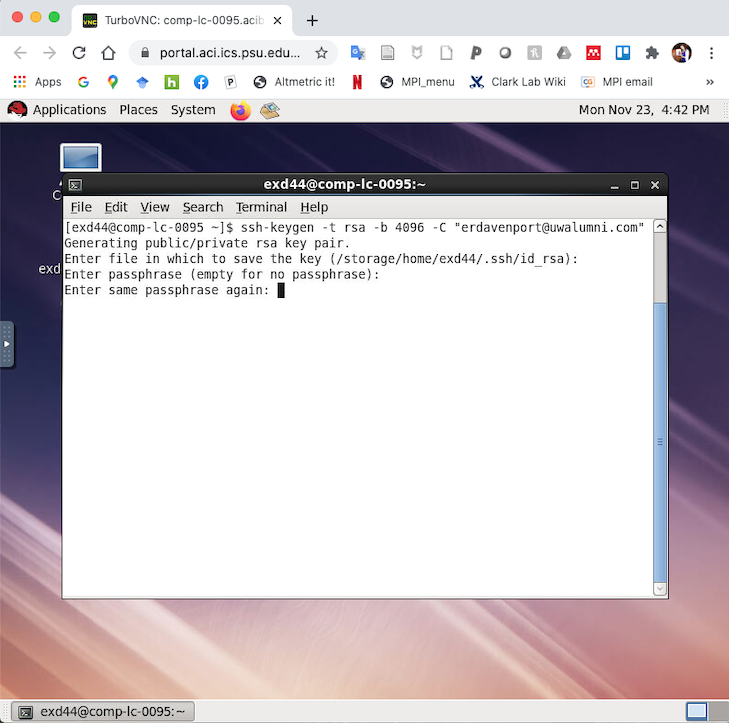

### 5. You should now see a message that your key has been saved. You should see a little image (yours will look different than the one on my screen).

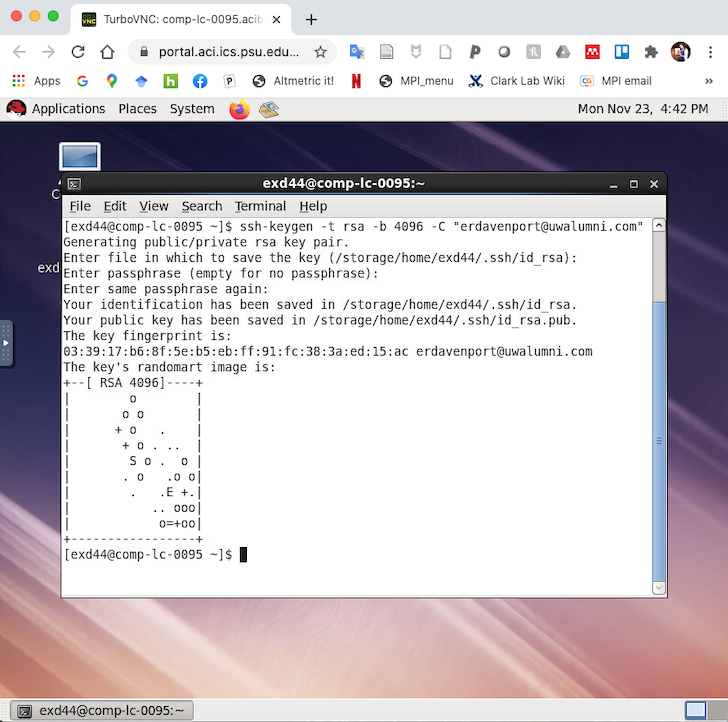

### 6. Next you need to add your SSH key to the ssh-agent using the code below:

`eval "$(ssh-agent -s)"`

You will very likely see a different agent pid number listed than the one in my screenshot.

### 7. Add the SSH key to your key file 

`ssh-ad ~/.ssh/id_rsa`

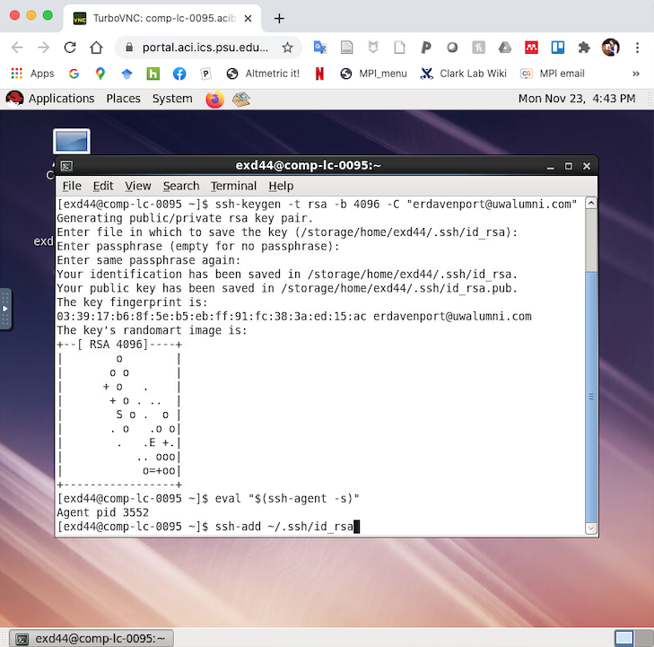

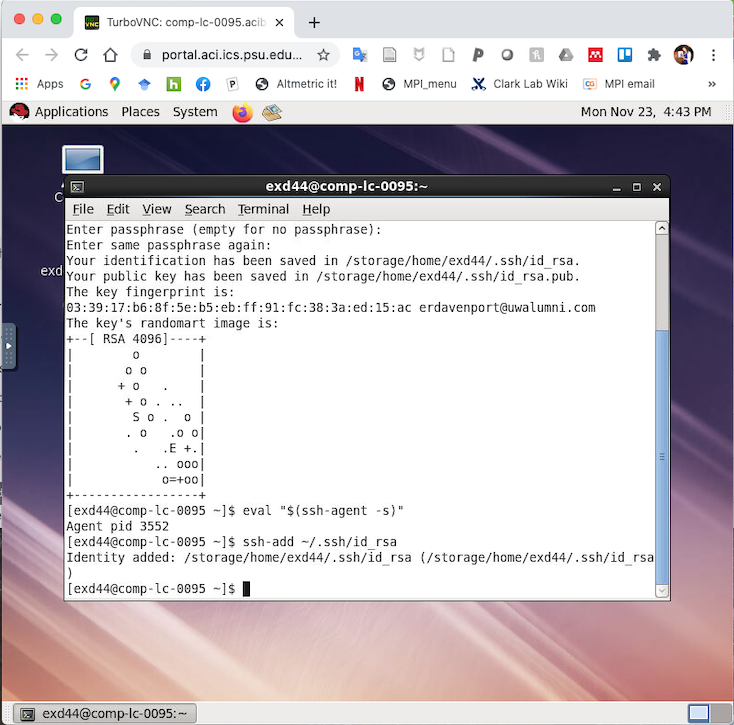

## Step 2: Add the new SSH key to your GitHub account

These instructions are spelled out [here](https://docs.github.com/en/free-pro-team@latest/github/authenticating-to-github/adding-a-new-ssh-key-to-your-github-account) as well as below. 

### 1. Print your public key to the screen using `cat`

`cat ~/.ssh/id_rsa.pub`

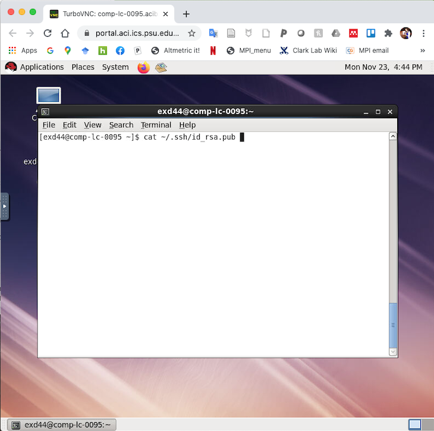

### 2. Copy the full contents of what was printed to the screen (should start with `ssh-rsa` and end with your email address)

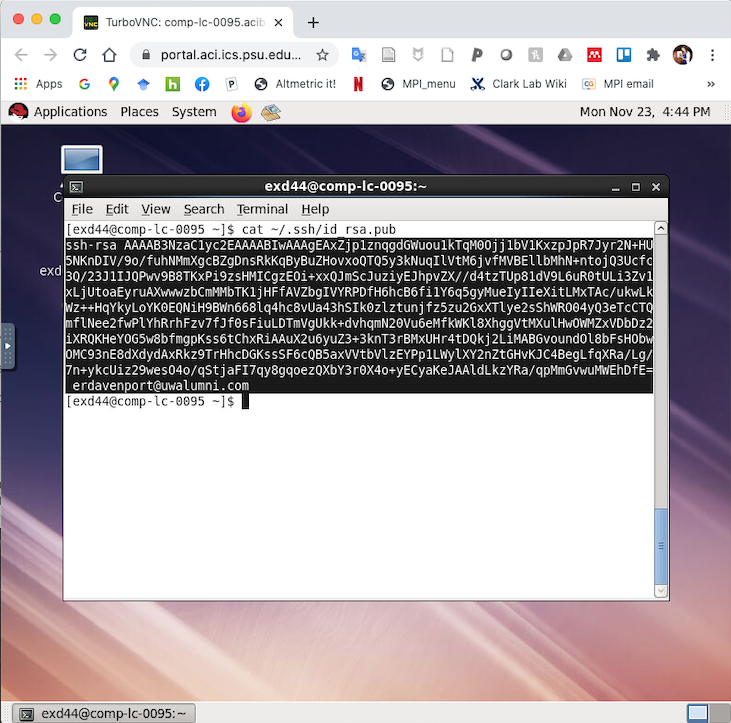

### 3. Open the noVNC tab to copy the contents of the clipboard to your personal computers clipboard.

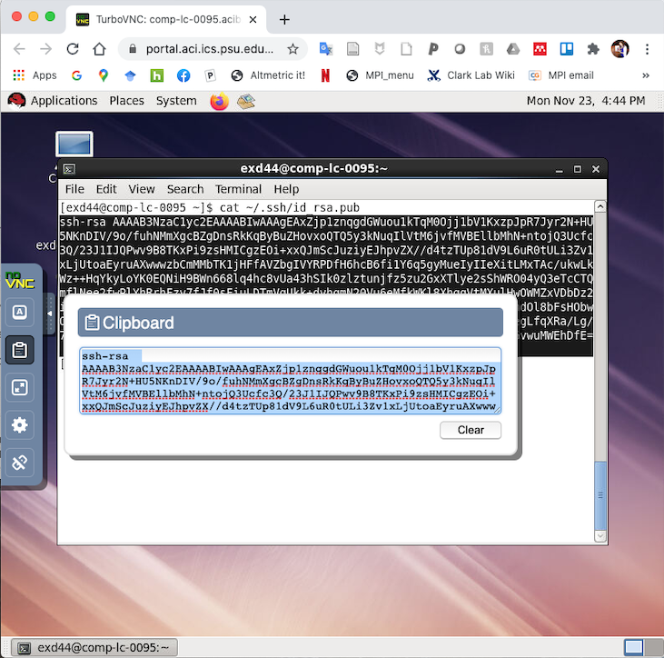

### 4. Log into your GitHub account and open the Settings menu (under your account picture in the upper right hand corner of the page)

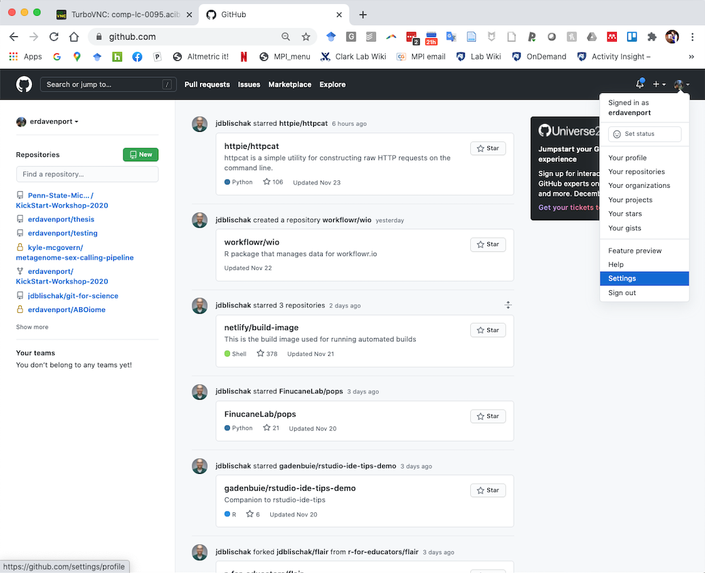

### 5. In the menu to the left, select the "SSH and GPG keys" option.

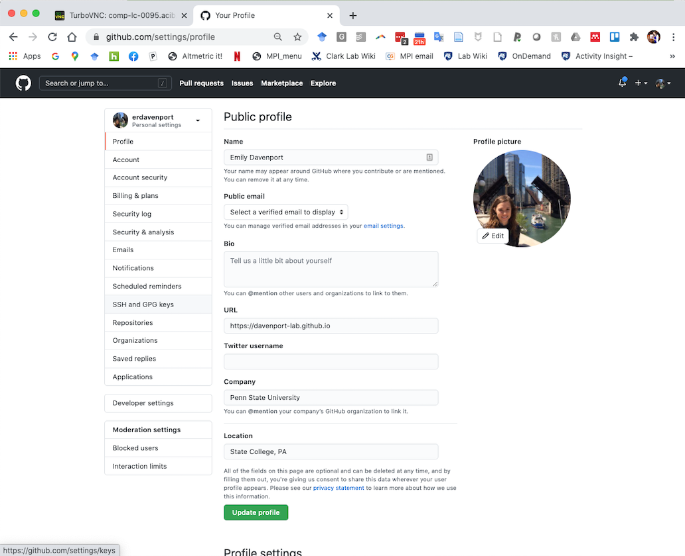

### 6. Create a new SSH key entry by clicking the green "New SSH key" button in the upper right hand corner of the page.

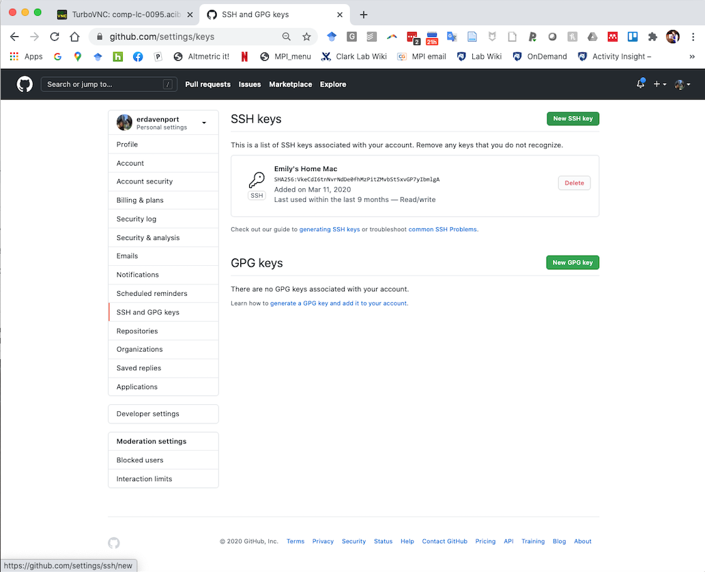

### 7. Add a title for the location of the key (ACI-ICDS, Roar, PSU, etc.) and paste the SSH key into the "Key" box. Click the green Add SSH key button when done. 

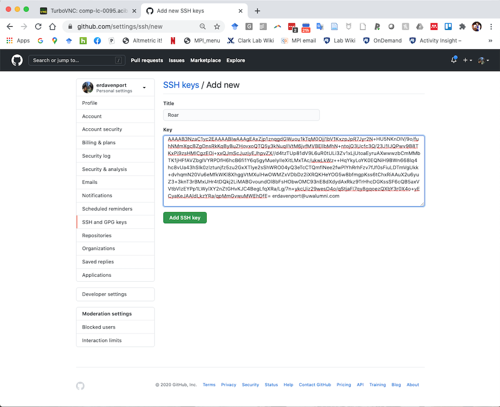

### 8. You should now see the new SSH key added. Done! Be sure to use the SSH option when adding remotes in git and not the HTTPS option. 

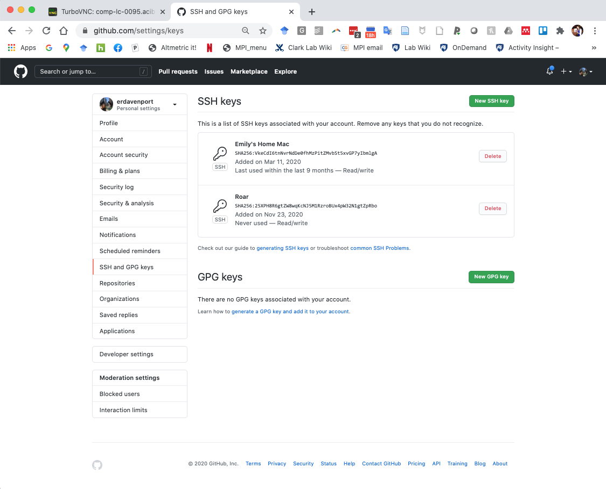
